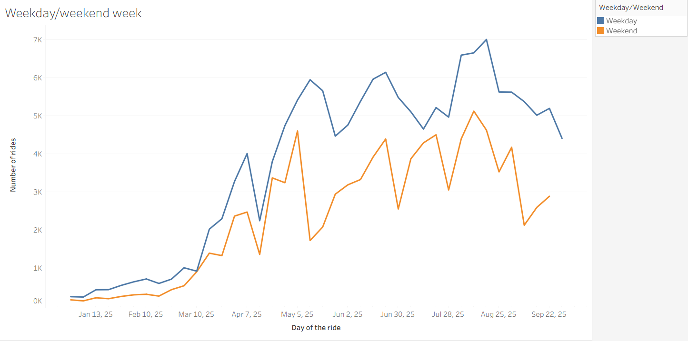

# Oslo_bikes_analysis

Hi! My name is Lev, and I’m a data analyst with 2.5 years of experience. I have been without a job for a while,  and one of the problems that prevented me from landing a job was the lack of recent projects that could demonstrate my skills. The Idea was to find a dataset about something I’m interested in, derive some hypotheses from the data using Tableau and SQL, and either confirm or reject them. 

### TL;DR

Goals of the project: 

- Find and explore a dataset
- Derive hypotheses from the data, and either confirm or reject them
- Practice my SQL and Tableau skills

Sources used:

- https://oslobysykkel.no/en
- [Seklima observations](https://seklima.met.no/observations/).

Tools used: 

- MS SQL Server
- Chat GTP
- Tableau Public
- Excel

Hypotheses tested:

- Hypotheses about rides on weekends VS weekdays
    - There are fewer rides on weekends than on weekdays
    - The rides are distributed differently on weekdays and weekends
- Hypotheses about the weather
    - Temperature and precipitation influence the number of rides to the same degree
    - Wind speed influences the number of rides less than two other factors, but is still considered

Results of the research:

- Weekends VS weekdays
    - There are indeed 35% fewer rides on weekends than on weekdays
    - Yes, on weekends, ride distribution is akin to normal distribution, while on weekdays, there are two spikes in the ridership around the start and the end of the workday
- Weather
    - Temperature influences the number of rides much more than precipitation ( R-squared of 0,67 for temperature VS 0,1 for precipitation); Starting from 18.9 °C, the number of rides decreases, presumably due to the heat.
    - The correlation between wind speed and the number of rides is negligible, with an R-squared of only 0,02.

### Finding and exploring the data

I am particularly interested in urban mobility, so I decided to explore the movement patterns of rental bikes or scooters. After a short search, I found a publicly available dataset by  https://oslobysykkel.no/en that contained data about where and when a ride started, and where and when it ended. 

The data was stored as JSON files, and there was a separate file for each month. After a short exploration, I downloaded all the files for the year 2025, from January to September. Then, I created an appropriate table in MS SQL Studio and wrote a procedure ([Ingest oslo trips.sql](https://github.com/Levfinkel/Oslo_bikes_analysis/blob/main/Ingest%20oslo%20trips.sql)
) to upload the files into the table.

Then I added ride_id to make working to create a unique identifier, cleaned up some doubles (props to the Oslo bikes, there were very few of them), and converted the time from UTC into Oslo time. After that, the data was ready for further exploration with Tableau. Initially, I intended to set up a direct connection from MS SQL Server to Tableau, but it turned out that Tableau Public doesn’t allow that, so I had to connect MS SQL Server to Excel, and Excel to Tableau.

First, I generated a graph detailing the number of rides by day throughout the year, which already gave me ideas for two possible hypotheses.

  

1. There were regular drops in the number of rides every few days, so I assumed that the most likely cause was the difference between weekends and weekdays.
2. There was a clear correlation between the time of year and the number of rides, which can probably be explained by the weather.

### Weekend/weekday divide

1. First, I decided to explore the hypothesis about the difference between weekends and weekdays. I built the graph detailing the average daily usage of the bikes, and it indeed showed that usage on weekends is much lower than on weekdays.

  

I wanted to see how much lower exactly, so I built the graph comparing average daily usage on weekdays VS weekends throughout the year, and it showed that the average number of rides on weekends was roughly 35% lower than on weekdays.

  

1. When I saw this difference in the number of rides between weekdays and weekends, I thought that there might also be a difference in the hourly distribution of rides.

  

And indeed, the difference was huge! On weekdays, there are two spikes around the start and end of the workday, which obviously means that people use the bikes to commute to work, while on weekends, when people can sleep in, there is one spike, and the distribution is much smoother.

It should also be noted that the late-night usage on weekdays is much lower, most likely for the same reason - people don’t need to wake up for work early in the morning.

### Correlations with weather

Next, I moved on to the second hypothesis -  I assumed a correlation between the number of rides and the weather, so I wanted to check this assumption more thoroughly. There was no weather data in the bike dataset, so I set out to find it, and found it here:  https://seklima.met.no/observations/.

There were more parameters than I ever knew existed, so I chose three that influence my own choice when I decide whether to rent a scooter or go by bus: precipitation, wind, and weather. 

When I chose them, I downloaded the data and appended it to the existing table. I refreshed the MS SQL - Excel - Tableau connection, and without much hassle, the weather data was ready to be explored.  

  

I expected, based on my own experience, that the influence of the temperature and precipitation would be more or less the same, and the wind’s would be lower but still considerable. In order to explore those assumptions, I built two graphs for each weather parameter: the number of rides by day + daily weather, and the correlation of the parameter in question and the number of rides. 

The results defied my expectations. If the temperature did indeed have a strong influence on the ridership, with the R-squared of 0,67, the precipitation influenced the number of rides only a bit, with the R-squared of only 0,1, and whether or not the weather was windy basically didn’t matter at all, since the R-squared was only 0,02. 

Another curious thing was that starting at 18.9 °C, the number of rides would start to drop, and by the hottest day of the year, with 25 °C, it would fall pretty significantly, presumably, because it was too hot.

### Conclusion

This project helped me practice the full data workflow: loading and cleaning raw JSON files with SQL, enriching them with external weather data, and exploring the results in Tableau. The analysis confirmed that bike usage in Oslo follows clear patterns. Weekdays have much higher activity than weekends, with strong morning and evening peaks that match the start and end of the workday. Weekends are smoother and start later in the day.

Weather effects were more mixed than I expected. Temperature had the strongest influence, with a clear increase in rides on warmer days until it became too hot. Precipitation had only a small effect, and wind almost none. 

Overall, this analysis not only helped me build a complete end-to-end project but also gave me a deeper understanding of mobility behavior in an urban environment. It demonstrated how combining domain knowledge, structured exploration, and statistical validation can lead to insights that are both intuitive and surprising.
